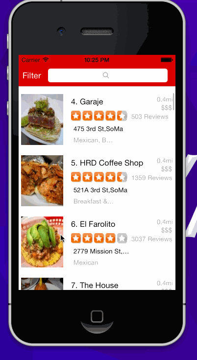

YELP
====

iOS 7 Yelp client. This app allows you to search  Yelp for businesses in San Francisco and also allows the user to sort results based on certian filters.

Time spent: 15 hours

Completed user stories
-

####Search results page
 * [x] Required: TODO: Table rows should be dynamic height according to the content height
 * [x] Required: TODO: Custom cells should have the proper Auto Layout constraints
 * [x] Required: Search bar should be in the navigation bar (doesn't have to expand to show location like the real Yelp app does).

####Filter page
 * [x] Required: The filters you should actually have are: category, sort (best match, distance, highest rated), radius (meters), deals (on/off).
 * [x] Required: The filters table should be organized into sections as in the mock.
 * [x] Required: You can use the default UISwitch for on/off states.
 * [x] Required: Radius filter should expand as in the real Yelp app
 * [x] Required: TODO: Categories should show a subset of the full list with a "See All" row to expand.
 * [x] Required: TODO: Clicking on the "Search" button should dismiss the filters page and trigger the search w/ the new filter settings.For now deals filter works should get the remaining filters working

Notes
-
 I am having trouble when I first load the app . The first 4 rows seems to null then after scroll I can see the results after which it gets back to normal

Walkthrough
-

